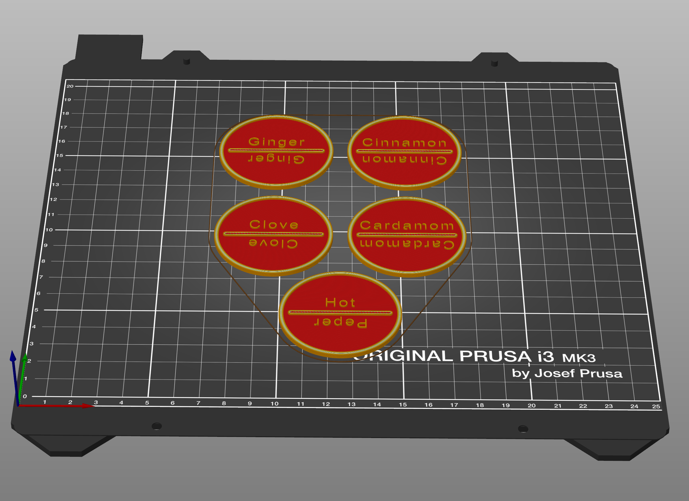
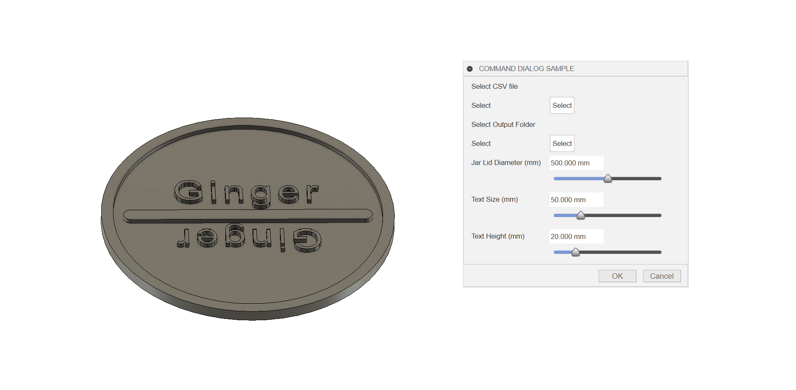

# Fusion 360 API Jar Lid Generator Project

This Fusion 360 add-in provides a command with a dialog for setting various parameters to design custom jar lids. The command 
allows users to interact with sliders, dropdowns, and checkboxes to configure settings for their design based on data from a CSV file.

## Description

This project helps you design custom jar lids and a parametric spice jar shelf using Fusion 360 and Python. The lids and 
shelf are parametric, allowing for easy changes in size and shape by modifying the script. The script leverages the Fusion 360 API 
to automate the design process, saving time and effort. Additionally, the generated lid designs can be adapted for 3D printing, 
ensuring precise construction and fit. The generated jar lid files are automatically saved in STL format to a specified
folder for easy use with 3D printers.

## Features

- **Custom Command**: Adds a custom command to the Fusion 360 interface.
- **Parameter Configuration**: Users can set parameters such as diameter, height, using sliders, dropdowns, and checkboxes..
- **Rib Distance Calculation**: Automatically reads and sets parameters from a CSV file containing multiple lid specifications.
- **STL File Export**: Automatically saves the generated jar lid designs in STL format to a specified folder.
- **Parametric Shelf**: Generates a customizable shelf for spice jars using parameters set in the script.

## Installation

1. **Clone or Download the Repository**: Download the repository to your local machine.
2. **Locate the Add-in Directory**:
    - On Windows: `C:\Users\<username>\AppData\Roaming\Autodesk\Autodesk Fusion 360\API\AddIns`
    - On Mac: `~/Library/Application Support/Autodesk/Autodesk Fusion 360/API/AddIns`
3. **Copy the Add-in**: Copy the downloaded add-in folder to the AddIns directory.
4. **Restart Fusion 360**: Restart Autodesk Fusion 360 to load the new add-in.

## Usage

1. **Start the Add-in**:
    - Open Fusion 360.
    - Go to the `Scripts and Add-Ins` menu.
    - Find the add-in named `Command Dialog Sample` and click `Run`.
2. **Using the Command**:
    - The command will be available in the `UTILITES` workspace under the `ADD-INS`.
    - Click on the command to open the dialog and configure your parameters.
    - The dialog includes sliders for width, length, hole size, thickness, and depth, as well as a dropdown for grid size.

### Prerequisites

- Autodesk Fusion 360
- Python

## License

This project is licensed under the MIT License. See the [LICENSE](LICENSE) file for details.

### Graphics

